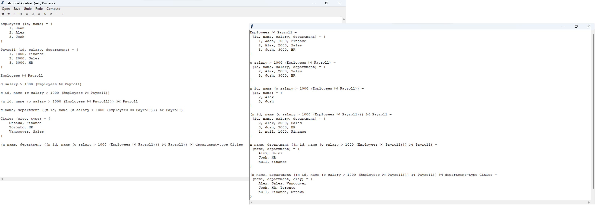

# COMP3005: Relational Algebra Query Processor

A relational algebra query processor written for COMP3005 at Carleton University.


See [manual](MANUAL.pdf) for requirements.

## Features

* Graphical user interface
* Loading and saving documents
* Undo and redo stack
* Multiple tables and queries per document
* Wide range of table operations
* Extensive suite of tests
* Error reporting

## How to Run

Everything is written in Python using only the standard library.
The only requirement is [Python3](https://www.python.org).

Invoke [main.py](main.py) to run the application.

```bash
python3 main.py
```

Invoke [unittest](https://docs.python.org/3/library/unittest.html) to run the tests.

```bash
python3 -m unittest
```

## Supported Table Operators

Table Operator | Form 1 | Form 2
:-: | :-: | :-:
Selection | σ Column Operator Value Table |
Projection | π Column1, ... Table |
Cross Join | Table1 × Table2 |
Natural Join | Table1 ⨝ Table2 | Table1 ⨝ Column Operator Value Table2
Left Outer Join | Table1 ⟕ Table2 | Table1 ⟕ Column Operator Value Table2
Right Outer Join | Table1 ⟖ Table2 | Table1 ⟖ Column Operator Value Table2
Full Outer Join | Table1 ⟗ Table2 | Table1 ⟗ Column Operator Value Table2
Union | Table1 ∪ Table2 |
Intersection | Table1 ∩ Table2 |
Subtraction | Table1 − Table2 |
Division | Table1 ÷ Table2 |
